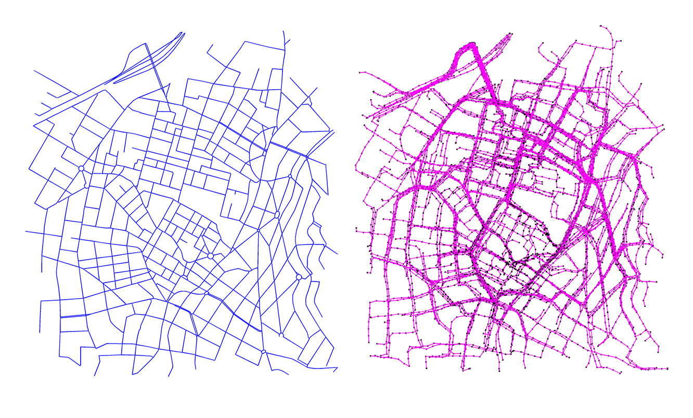
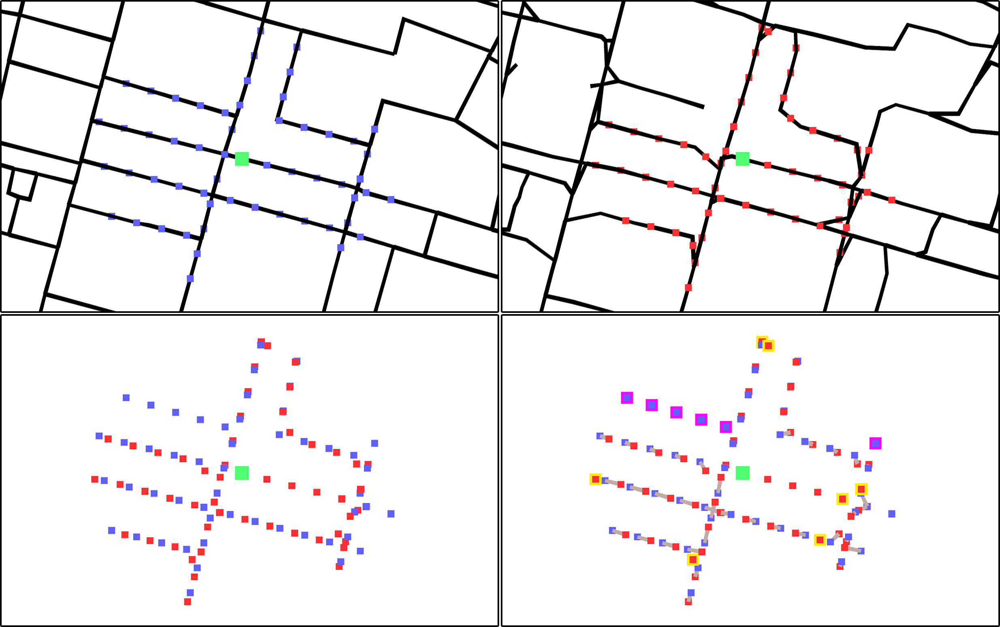

# RoadMapConstructionVisualEvaluator

A framework in C# to evaluate road graphs inferred by trajectory-based road map construction algorithms. Part of master thesis for the University Utrecht Department of Information and Computing Science. This version needs and uses the Unity game engine for visualisations. We heavily recommend installing Unity and working with the visual version. For a non-visual you can look [here](https://github.com/AriSaadon/RoadMapConstructionEvaluation).

---

## Features



- Import directed, undirected and hybrid maps.
- Transform directedness and size of imported maps.
- Export edited maps.
- Import trajectory sets.
- Synthetically generate shortest path trajectories for imported maps.
- Export generated trajectory sets.
- Evaluate similarity between two imported maps using the graph sampling similarity measure by [Biagioni and Eriksson](https://www.cs.uic.edu/~jakob/papers/biagioni-trr12.pdf).
- Visualize maps, trajectories and evaluated local neighbourhoods.

---

## Formats

We follow a common format in the map construction field, similar to the one used in data-sets on [Mapconstruction](http://mapconstruction.org/). The following format is expected for maps.

A *Vertices* file, with on each line:
> vertexId, projectedX, projectedY

An *Edges* file, with on each line:
> edgeId, vertexId1, vertexId2, directedness

Trajectory sets are expected in a folder containing a *trip_x* file for each trajectory, with on each line:
> projectedX projectedY time

We provide [Projectors](https://github.com/AriSaadon/RoadMapConstructionEvaluation/tree/main/Projectors) to help with conversion of coordinates. Additionally, with help of external tools, extracted Open Street Map road graphs can be used. The [OSMParser](https://github.com/AriSaadon/RoadMapConstructionEvaluation/tree/main/OSMParser) helps with the final small step to get such a graph to our format.

---

## Usage

The example below shows a sketch of how a single local neighbourhood can be evaluated.

```csharp
drawer.Refresh();	//Clean any previously shown output.

Map gt = importMap.ReadMap($"data/Ground-truth");	
Map cm = importMap.ReadMap($"data/Constructed-map");

drawer.DrawRoads(gt, new Color32(128, 148, 157, 255), Vector3.zero);
drawer.DrawRoads(cm, new Color32(195, 172, 165, 255), Vector3.zero);

drawer.DrawTrajectories($"data/trajectories", 100, Vector3.zero, Color.magenta,
importTraj);	//Draw 100 trajectories from the provided folder.

Camera.main.transform.position = gt.GetCenter();	//Position cam to GT map.

(float, float) similarityScore = EvalRandomNeighbourhood(gt, cm, 200, 100, 20);
```
 
The evaluation can be visualized for a detailed overview of the local neighbourhood matching.
<br>


